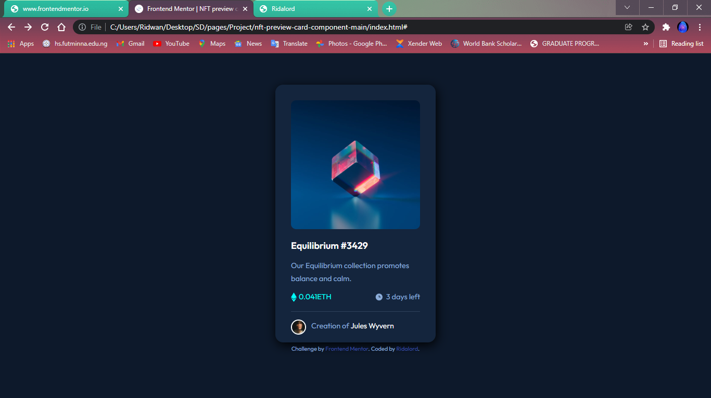
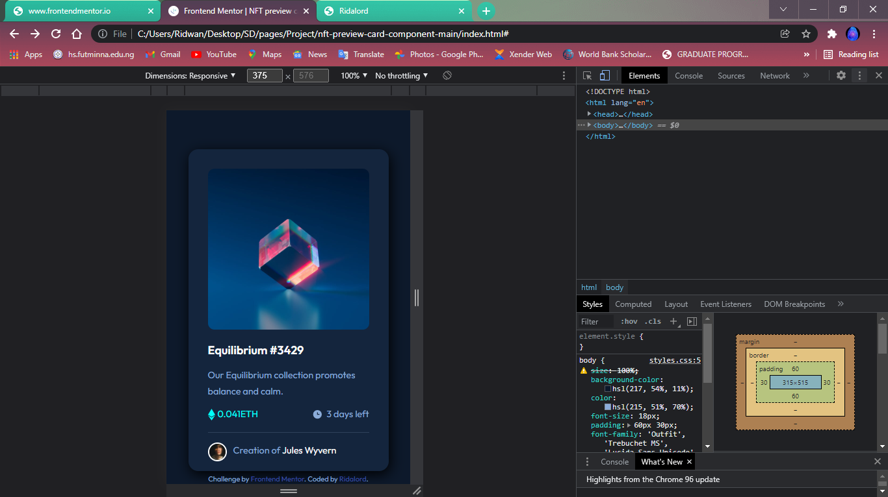

# Frontend Mentor - NFT preview card component solution

This is a solution to the [NFT preview card component challenge on Frontend Mentor](https://www.frontendmentor.io/challenges/nft-preview-card-component-SbdUL_w0U). Frontend Mentor challenges help you improve your coding skills by building realistic projects. 

## Table of contents

- [Overview](#overview)
  - [The challenge](#the-challenge)
  - [Screenshot](#screenshot)
  - [Links](#links)
- [My process](#my-process)
  - [Built with](#built-with)
  - [What I learned](#what-i-learned)
  - [Continued development](#continued-development)
  - [Useful resources](#useful-resources)
- [Author](#author)

**Note: Delete this note and update the table of contents based on what sections you keep.**

## Overview

### The challenge
This challenge entails designing a responsive nft card with HTML and CSS knowledge showing all active states.

Users should be able to:

- View the optimal layout depending on their device's screen size
- See hover states for interactive elements

### Screenshot

The above link shows the solution output to the desktop site.

The above link shows the mobile responsive solution.

### Links

- Solution URL: [Add solution URL here](https://your-solution-url.com)
- Live Site URL: [Add live site URL here](https://your-live-site-url.com)

## My process
I started building the site by completing the html markup, and adding som div tags. Then I created an external CSS stylesheet for styling the site starting with the mobile approach. Using the created div elements I was able to style the sections of the pages by add colors, flexbox, font styles and other relevant styling where necessary. 
### Built with

- Semantic HTML5 markup
- CSS custom properties
- Flexbox
- Mobile-first workflow

### What I learned
While working on this project i was able to learn how to style eusing the absolute position attribute where i had to add the view icon to the equilibrium image.

### Continued development

I want to focus on the use of CSS grids and flexbox in future projects. I intend on designing prjects with user friendly animation that are well responsive.

### Useful resources

- [Example resource 1](https://www.example.com) - This helped me for XYZ reason. I really liked this pattern and will use it going forward.
- [Example resource 2](https://www.example.com) - This is an amazing article which helped me finally understand XYZ. I'd recommend it to anyone still learning this concept.

**Note: Delete this note and replace the list above with resources that helped you during the challenge. These could come in handy for anyone viewing your solution or for yourself when you look back on this project in the future.**

## Author

- Website - [Ridwan Alabi](https://www.your-site.com)
- Frontend Mentor - [@Ridalord](https://www.frontendmentor.io/profile/Ridalord)
- Twitter - [@alaby_seun](https://www.twitter.com/yourusername)

